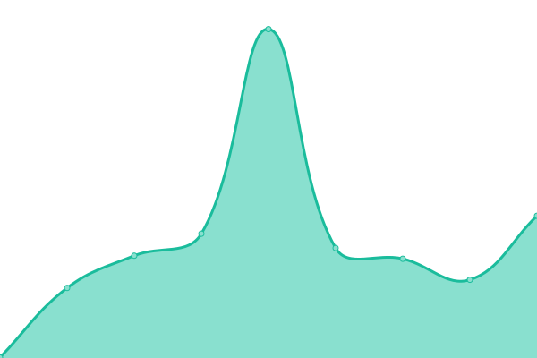
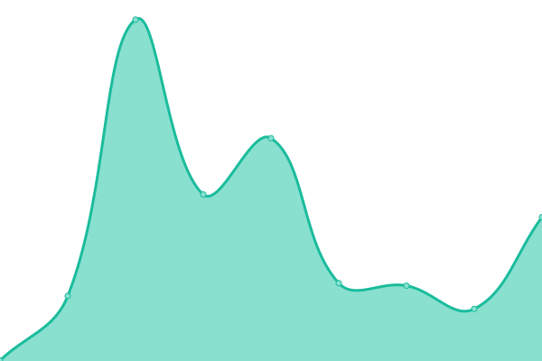
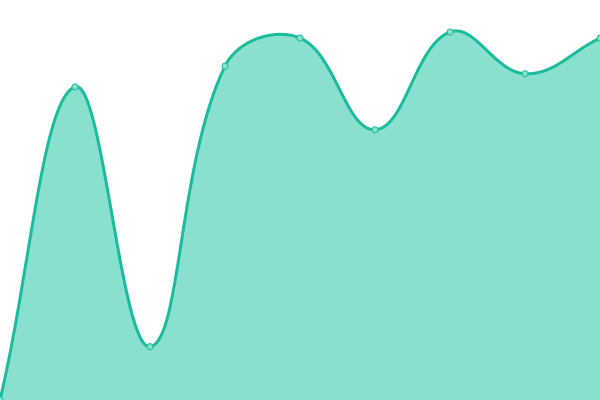

# [📈 Live Status](https://demo.upptime.js.org): <!--live status--> **🟥 Complete outage**

This repository contains the open-source uptime monitor and status page for [MIT Preparation Academy](mitpa.tech), powered by [Upptime](https://github.com/upptime/upptime).

With [Upptime](https://upptime.js.org), you can get your own unlimited and free uptime monitor and status page, powered entirely by a GitHub repository. We use [Issues](https://github.com/MITPAcademy/status.mitpa.tech/issues) as incident reports, [Actions](https://github.com/MITPAcademy/status.mitpa.tech/actions) as uptime monitors, and [Pages](https://demo.upptime.js.org) for the status page.

<!--start: status pages-->
<!-- This summary is generated by Upptime (https://github.com/upptime/upptime) -->
<!-- Do not edit this manually, your changes will be overwritten -->
<!-- prettier-ignore -->
| URL | Status | History | Response Time | Uptime |
| --- | ------ | ------- | ------------- | ------ |
|  [PRACTA Site](https://www.practa.tech) | 🟥 Down | [practa-site.yml](https://github.com/PRACTAcademy/status.practa.tech/commits/HEAD/history/practa-site.yml) | 

 277ms
     
 | 

<a href="https://PRACTAcademy.github.io/status.practa.tech/history/practa-site">99.62%</a>
    

|  [PRACTA CDN](https://cdn.practa.tech) | 🟥 Down | [practa-cdn.yml](https://github.com/PRACTAcademy/status.practa.tech/commits/HEAD/history/practa-cdn.yml) | 

 278ms
     
 | 

<a href="https://PRACTAcademy.github.io/status.practa.tech/history/practa-cdn">99.63%</a>
    

|  [PRACTA API](https://api.practa.tech/status) | 🟥 Down | [practa-api.yml](https://github.com/PRACTAcademy/status.practa.tech/commits/HEAD/history/practa-api.yml) | 

 427ms
     
 | 

<a href="https://PRACTAcademy.github.io/status.practa.tech/history/practa-api">99.79%</a>
    

|  [PRACTA Files](https://files.practa.tech) | 🟥 Down | [practa-files.yml](https://github.com/PRACTAcademy/status.practa.tech/commits/HEAD/history/practa-files.yml) | 

 2062ms
     
 | 

<a href="https://PRACTAcademy.github.io/status.practa.tech/history/practa-files">10.42%</a>
    

|  [PRACTA Docs](https://docs.practa.tech) | 🟥 Down | [practa-docs.yml](https://github.com/PRACTAcademy/status.practa.tech/commits/HEAD/history/practa-docs.yml) | 

 256ms
     
 | 

<a href="https://PRACTAcademy.github.io/status.practa.tech/history/practa-docs">99.80%</a>
    

<!--end: status pages-->

[**Visit our status website →**](https://demo.upptime.js.org)

## 📄 License

- Powered by: [Upptime](https://github.com/upptime/upptime)
- Code: [MIT](./LICENSE) © [Anand Chowdhary](https://anandchowdhary.com), supported by [Pabio](https://pabio.com)
- Data in the `./history` directory: [Open Database License](https://opendatacommons.org/licenses/odbl/1-0/)
